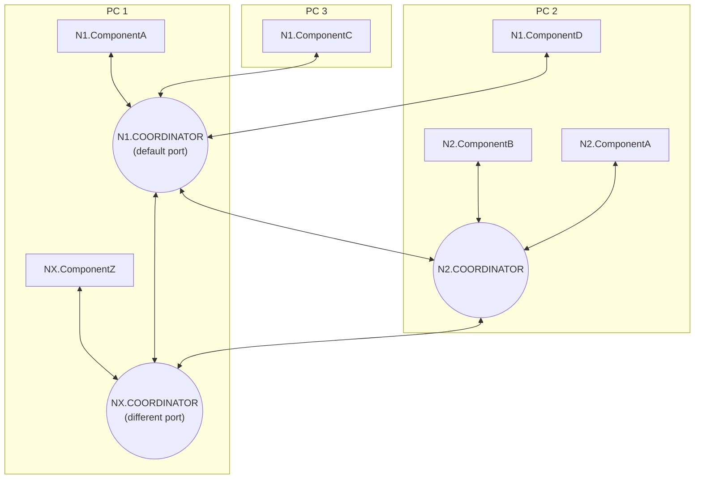
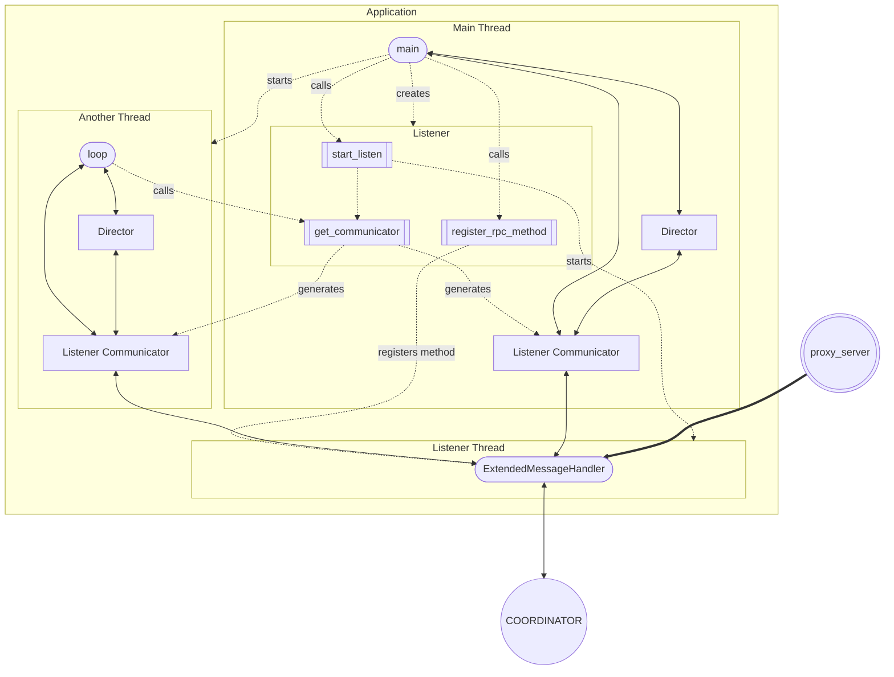
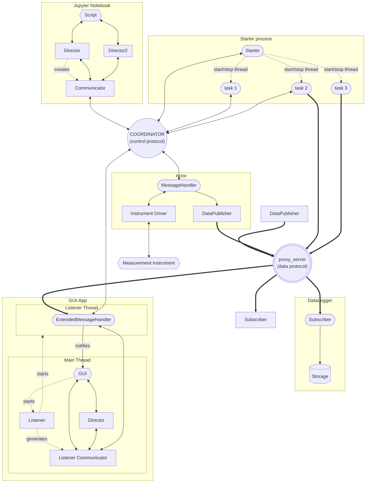

# Getting started

This tutorial gives an overview how to start a LECO setup in Python.

## Installation

Install PyLECO as described in the README.

Eventually, you will be able to install PyLECO via pip or conda:
```pip install pyleco```

## Setup the Infrastructure

### The Coordinators

The core of the infrastructure are communication servers, called Coordinators.
As LECO consists in two parts, the control protocol and the data protocol, there are two servers:

1. The _Coordinator_ in [`coordinator.py`](pyleco/coordinators/coordinator.py) is the server of the control protocol.
2. [`proxy_server.py`](pyleco/coordinators/proxy_server.py) contains the server of the data protocol.

In order to start these Coordinators, execute `coordinator` and `proxy_server` in a terminal.
Alternatively, execute the corresponding files with python:
for example, change directory in the folder of this getting started file and execute `python3 pyleco/coordinators/coordinator.py` under linux or `py pyleco/coordinators/coordinator.py` under Windows with the Windows Launcher installed.

If you need settings which are different from the defaults, you can use command line parameters.
The command line parameter `-h` or `--help` gives an overview of all available parameters.
For example `python3 pyleco/coordinators/coordinator.py -h` gives the information, while `python3 pyleco/coordinators/coordinator.py --port 12345` makes the Coordinator listen on tcp port 12345 instead of the default one.

### The Starter

LECO allows to have many small parts working together instead of one monolithic program.
For convenience, there is an additional server, the [`Starter`](pyleco/management/starter.py), which can be used to start a bigger number of small parts all at once. 
With the starter, we can sidestep having to start all these small parts individually in their own terminal window. 

The starter scans a directory (given as argument) for python files.
It will start, if told to do so, the method `task` of a given file name in a separate thread.
That allows to specify several different tasks, for example each one controlling one measurement instrument, and to start them by sending a command to the starter.
How this works exactly, is described below. 

In order to start the starter itself, execute `starter --directory ~/tasks` in a terminal with the tasks being in the subfolder `tasks` of the home directory.
Alternatively, execute its file with the path to the directory, for example `python3 pyleco/management/starter.py --directory ~/tasks`. 

#### Define a Task File

The example file [`pymeasure_actor.py`](examples/pymeasure_actor.py) contains an example, how a task file in that directory could look like:

The first docstring of the file should be the description of that task.
The starter offers that docstring, if you query it for its available tasks.

You have to specify a `task` method with exactly one parameter, the `stop_event`.
The starter will give a `threading.Event` instance as an argument in order to tell the task when to stop.
You could write any `task` method, which checks regularly the `stop_event` and stops, if that event is set.
PyLECO offers helper methods to do most of the work for controlling an instrument.

If you have a python class you want to control remotely, for example a [pymeasure](https://pymeasure.readthedocs.io) instrument driver for a fiber laser called `YAR`, you can use the [`Actor`](pyleco/actors/actor.py).

In this case, this will be your task file `YAR_controller.py`:

```python
"""Example scheme for an Actor for pymeasure instruments. 'fiberAmp'"""

from pyleco.actors.actor import Actor
from pymeasure.instruments.ipgphotonics import YAR

# Parameters
adapter = "ASRL5"  # VISA resource string, for example serial port COM5

def task(stop_event) -> None:
    """The task which is run by the starter."""
    with Actor(
        name="fiberAmp",  # you can access it under this name
        device_class=YAR,  # the class to instantiate later on
    ) as actor:
        actor.connect(adapter)  # create an instance `actor.device = YAR(adapter)`

        actor.listen(stop_event=stop_event)  # listen for commands
```

The `Actor` will listen under the name `fiberAmp` for incoming commands and handle them until the `stop_event` is set.
For example you can get or set properties of the `YAR` instance, or you can call methods.

#### Start / Stop a Task

Now we have our three servers (Coordinator, proxy_server, Starter) up and running, but the task is not yet started.
In order to start a task, we have to tell the Starter to do so.
The easiest way is to use the [`StarterDirector`](pyleco/directors/starter_director.py) (found in the `directors` directory) in a python console or script:
```python
from pyleco.directors.starter_director import StarterDirector
director = StarterDirector(actor="starter")
director.start_tasks(["YAR_controller"])
```

The `actor` parameter tells the Director the name of the `Starter` instance which defaults to `"starter"`.
As the task file is named `YAR_controller.py`, the task name is `"YAR_controller".
You can give a list of tasks to start.

The starter director has also methods to stop a task, give a list of available tasks, and to give a list of the state of the known tasks (running, stopped, crashed).


## Control an Experiment

### Control the Instrument: The Director

Now we have our severs running and also the task controlling our fiber amplifier is running.
In order to remotely control the fiber amplifier, we have to send messages to it.
Again we have a director to direct the actions of the fiber amplifier.

This time, the director is a more generic one, the [`TransparentDirector`](pyleco/directors/transparent_director.py) (also in the directors directory).
If you read or write any property of the TransparentDirector's `device`, it will read or write to the remotely controlled instrument.
For example
```python
from pyleco.directors.transparent_director import TransparentDirector

director = TransparentDirector(actor="fiberAmp")

if not director.device.emission_enabled:
    director.device.emission_enabled = True

```
will read, whether the emission of the fiber amplifier is enabled, if not, it will be enabled.

Behind the scenes, the transparent director sends a request to the Actor named `"fiberAmp"` (remember, that is the name we gave to the actor in the task file) to read the `emission_enabled` property of the `YAR` instance.
The Actor will read the `device.emission_enabled` property and return it to the director.

Alternatively, you could get/set the parameters manually.
The following lines are equivalent to the previous code:
```python
if not director.get_parameters(parameters=["emission_enabled"])["emission_enabled"]:
    director.set_parameters({"emission_enabled": True})
```
The get/set parameters method allow to get/set more than one parameter in one message.

If you want to call the method `clear` of the `YAR` instance, you can use `director.call_action(action="clear")`.
Any positional or keyword arguments you give to the `call_action` method will be given to the `clear` method.
For example `director.call_action(action="set_power", power=5)` will cause the actor to call `device.set_power(power=5)`.


### Different Computers

LECO is not limited to a single computer, you can use it within a wider network.

#### Single Coordinator Setup

Each Component (any program participating in LECO) needs to connect to a Coordinator.
Per default, the PyLECO components look for a Coordinator on the same computer (localhost).
If the Coordinator is on another computer or listens on another port, you can specify these value as arguments.
For example: `Actor(host="myserver.com", port=12345)` will connect to the Coordinator on a computer available (via DNS) as `myserver.com` which listens on the port `12345`.
You can also specify the IP address instead of urls.

#### Multi Coordinator Setup

##### Setup of the Coordinators

You can have more than one Coordinator, even on the same computer.
Each Coordinator needs its own combination of host name and port number (a single socket).
That means, they have at least to reside on different computers or have different port numbers.

You can tell a Coordinator about other Coordinators, either by specifying the `--coordinators` command line argument (a comma separated list of coordinator addresses) or by using the `CoordinatorDirector`'s `add_nodes({namespace: address})` command.
If you tell one Coordinator about a second one, it will connect to all other Coordinators, to which the second one is connected. 
In this way, the network is established automatically, and Components connected to a single Coordinator, can get access to all other Components as soon as this single Coordinator is connected to the wider network.

##### The namespace

Each Coordinator establishes a _Namespace_, which defaults to the name of the computer it resides on.
Each Component connected to that Coordinator belongs to that namespace.
The _full name_ of the Component consists of the namespace and its own name, joined by a period.
For example, let's say the Coordinator of our setup in the beginning has the namespace `N1`, then the fiber amplifier would be available under the name `N1.fiberAmp`.
If you do not specify the namespace, LECO assumes that the recipient's namespace is the same as the sender's namespace, similar to the area code of a phone number.

You can send from any Component connected to any Coordinator (which has to be connected to `N1` Coordinator or be `N1` Coordinator itself) a message to `N1.fiberAmp` and it will arrive there.
The response will always return as well, as you must specify the sender's namespace.

All Components (rectangular elements) on different computers can communicate with each other in the following graph.
Note that all Components connected to a certain Coordinator (circle) share the same _Namespace_, e.g. `N1`.




### Collect Data

If you're doing an experiment, you typically want to collect data as well.

You can publish data via the data protocol.
As a helper class, you can use the [`DataPublisher`](pyleco/utils/data_publisher.py):
```python
from pyleco.utils.data_publisher import DataPublisher

publisher = DataPublisher(full_name="N1.abc")
publisher.send_data("def")
```
That will publish the data `"def"` from the sender `"N1.abc"`.

Anyone connected to the same proxy_server can listen to that published data.
You have to subscribe to the sender `"N1.abc"` first, though.

The [`DataLogger`](pyleco/management/data_logger.py) (in the `management` directory) collects these data snippets (if they are in the form of dictionaries: `{variable: value}` with a variable name and an associated value) and creates datapoints.
Afterwards you can save the collected datapoints.


## Include LECO in your own Programs

### LECO Basics

Some basic information about LECO and its python implementation.

#### JSON-RPC and Remote Procedure Calls

Default messages are based on Remote Procedure Calls (RPC) according to the [JSON-RPC](https://www.jsonrpc.org/specification) protocol.
Basically you request to execute a procedure call on a remote station and receive the response of that call.

#### Communicator

There are several tools in the `utils` directory, which offer some convenience methods to send RPC requests via the LECO protocol and to deceipher the responses.
For interchangeability, they all follow a consistent API defined in the `CommunicatorProtocol` and can be used as an argument for any `communicator` parameter.

For example `communicator.ask_rpc(receiver="N1.fiberAmp", method="get_parameters", parameters=["emission_enabled"])` would call the `get_parameters` method of the actor called `"N1.fiberAmp"` with the keyword argument `parameters=["emission_enabled"]`.
The result of that method is the content, for example `{"emission_enabled": True}`.
This example is the spelled out code behind the call of the director example shown above.

The most simple util implementing the `CommunicatorProtocol` is the [`Communicator`](pyleco/utils/communicator.py) (in `utils` directory).
It allows to send messages and read the answer.
However, it does not listen continuously for incoming messages.
It is great for scripts as it does not require additional threads.
_Directors_ create such a `Communicator`, unless they are given one.


### Daemon Type

For a program, which runs happily in the background listening for commands and executing them, you can base your code on the [`MessageHandler`](pyleco/utils/message_handler.py) (in `utils` directory).
The MessageHandler will listen to incoming messages and handle them in a continuous loop.
The `listen` method has three parts:

1. The method `_listen_setup`, where you can specify, what to do at the start of listening,
1. the method `_listen_loop_element`, which is executed in the loop until the `stop_event` is set.
   Typically, it listens for incoming messages and handles them,
1. the method `_listen_close`, which finishes after having been told to stop.


If you want to make a method available for RPC calls, you can use the `register_rpc_method` method.
That allows any Component to use that method via `ask_rpc`.
For example `register_rpc_method(do_something)` would register the method `do_something`, such that someone else could do `ask_rpc(method="do_something")` calling that method.

The message handler (and its subclasses) have to be in their listening loop to do their work:
```python
from pyleco.utils.message_handler import MessageHandler

message_handler = MessageHandler("my_name")
message_handler.listen()  # infinity loop
```

The [`ExtendedMessageHandler`](pyleco/utils/extended_message_handler.py) is a subclass, which can subscribe to the data protocol and act on received data messages.


### In an Additional Thread

Sometimes, you want to have continuous LECO communication, but do not want to block the thread, for example in a GUI.

The [`Listener`](pyleco/utils/listener.py) (in `utils` directory) starts a special form of the `MessageHandler` in another thread and offers a communicator:

```python
from pyleco.utils.listener import Listener
from pyleco.directors.transparent_director import TransparentDirector

listener = Listener("my_name")
listener.start_listen()
communicator = listener.get_communicator()

listener.register_rpc_method(my_method)

director = TransparentDirector(communicator=communicator)
```

In this example, the message handler will offer the `my_method` method via RPC (via the listener's `register_rpc_method`).
However, that method will be executed in the message handler thread!
You can send messages via the message handler by using the listener's `communciator`.
Here the director uses this communicator instead of creating its own one with its own name.

The following graph shows how the `Listener` is used in a (multi-threaded) application.
Rounded elements run in a continuous loop.


The `main` method creates a `Listener` and calls its `start_listen` method, which creates a new thread (`Listener Thread`) with an `ExtendedMessageHandler`.
It can use the `Listener Communicator` (generated via `get_communicator`) to communicate to the LECO network, either directly or via one or several `Director`s.
Similarly, another thread can use (its own) `Listener Communicator` to communicate with the LECO network.


## Graphical overview

Here a graphical overview over a single computer experimental setup.
Solid lines indicate data flow, dashed lines actions.
Rounded fields elements run in a continuous loop.
Circles are Coordinators.
Note that the control protocol (with the _COORDINATOR_) is symmetric, while the data protocol (_proxy_server_, bold lines) is one way only.


The `Actor` contains a `MessageHandler` handling incoming messages in order to control a hardware measurement instrument via a _Driver_. It also has a `DataPublisher` to publish measurement data regularly.

A script uses _Directors_ to send messages via a `Communicator` (generated by the first _Director_) to that measurement instrument.

The `Starter` controls several _tasks_ in their own threads.
These tasks may communicate via the LECO protocol individually.
They can be, for example, instrument actors.

The GUI-App has a `Listener` in its main thread, which starts an `ExtendedMessageHandler` in another thread and offers its _Listener Communicator_ in order to communicate.
The GUI can then communicate via that Communicator to the network, either directly or using _Directors_.
It can send commands to the measurement instrument via the _Actor_.
It can also subscribe to the data published by the _Actor_.

The `DataLogger` collects the data published via the data protocol (`proxy_server`).
